# SAATHI - Database Foundation Architecture & Technical Reference

**System**: SAATHI (Rural Business Intelligence, Financial Guidance & Mentorship Assistant)  
**Database Engine**: PostgreSQL 15+ (Supabase)  
**Target Audience**: Millions of rural/semi-urban Indian micro-entrepreneurs  
**Security Model**: Row Level Security (RLS) with Supabase Auth isolation  
**Financial Precision**: Exact `NUMERIC` types across all monetary and interest values (Zero Floating Point)

---

## 1. Migration Manifest

The database is structured into 15 idempotent, modular migrations:

| Order | File Name | Domain / Purpose | Key Tables Created |
| :--- | :--- | :--- | :--- |
| **001** | `001_extensions.sql` | Extensions, ENUMs & Triggers | `update_updated_at_column()`, 10 ENUM types |
| **002** | `002_profiles.sql` | Identity & Consents | `profiles`, `user_consents`, `user_devices` |
| **003** | `003_locations.sql` | Geographic Master & Privacy | `location_masters`, `user_locations` |
| **004** | `004_business.sql` | Business Profiles & Ideas | `business_profiles`, `business_ideas` |
| **005** | `005_finance.sql` | Resources & Project Plans | `user_resources`, `financial_profiles`, `project_plans`, `financial_calculation_snapshots` |
| **006** | `006_schemes.sql` | Government Schemes & Rules | `schemes`, `scheme_rules`, `scheme_documents`, `scheme_eligibility_assessments` |
| **007** | `007_loans.sql` | Loan Products & EMI Amortization | `loan_products`, `loan_assessments`, `repayment_schedules`, `repayment_schedule_items` |
| **008** | `008_market.sql` | Market Intelligence & Provenance | `data_sources`, `data_source_references`, `market_areas`, `market_indicators`, `competitor_records`, `distribution_channels`, `supplier_records`, `market_opportunities`, `market_reports` |
| **009** | `009_ai.sql` | AI Results, Costs & Simulations | `ai_analysis_results`, `analysis_assumptions`, `business_cost_models`, `business_revenue_models`, `business_simulations` |
| **010** | `010_marketing.sql` | Marketing & Growth Roadmaps | `marketing_plans`, `expansion_plans` |
| **011** | `011_mentor.sql` | Action Checklist & Tasks | `mentor_plans`, `mentor_tasks` |
| **012** | `012_conversations.sql` | Conversational Engine & Voice | `conversations`, `conversation_messages`, `voice_sessions` |
| **013** | `013_sync.sql` | Offline Sync & Localization | `sync_records`, `notifications`, `localized_content` |
| **014** | `014_security.sql` | RLS, Auditing & Storage | RLS on 100% of tables, `audit_logs`, 4 Supabase Storage buckets |
| **015** | `015_seed.sql` | Master Seed & Baramati Demo | Multi-language localized content, Baramati/Supe demo persona (Ramesh Patil) |

---

## 2. Entity Relationship Diagram (ERD)

```mermaid
erDiagram
    AUTH_USERS ||--|| PROFILES : "1:1 identity"
    PROFILES ||--o{ USER_CONSENTS : "grants"
    PROFILES ||--o{ USER_DEVICES : "registers"
    PROFILES ||--o{ USER_LOCATIONS : "resides in"
    LOCATION_MASTERS ||--o{ USER_LOCATIONS : "references"
    LOCATION_MASTERS ||--o{ MARKET_AREAS : "defines radius"
    
    PROFILES ||--o{ BUSINESS_PROFILES : "owns"
    PROFILES ||--o{ BUSINESS_IDEAS : "proposes/receives"
    BUSINESS_PROFILES ||--o{ BUSINESS_IDEAS : "associates"
    BUSINESS_IDEAS ||--o{ BUSINESS_COST_MODELS : "models cost"
    BUSINESS_IDEAS ||--o{ BUSINESS_REVENUE_MODELS : "models revenue"
    BUSINESS_IDEAS ||--o{ BUSINESS_SIMULATIONS : "simulates"
    
    PROFILES ||--o{ USER_RESOURCES : "declares"
    PROFILES ||--o{ FINANCIAL_PROFILES : "maintains"
    PROFILES ||--o{ PROJECT_PLANS : "builds (PS-91)"
    PROJECT_PLANS ||--o{ FINANCIAL_CALCULATION_SNAPSHOTS : "snapshots"
    
    SCHEMES ||--o{ SCHEME_RULES : "governed by"
    SCHEMES ||--o{ SCHEME_DOCUMENTS : "requires"
    PROFILES ||--o{ SCHEME_ELIGIBILITY_ASSESSMENTS : "assessed for"
    SCHEMES ||--o{ SCHEME_ELIGIBILITY_ASSESSMENTS : "evaluates"
    
    LOAN_PRODUCTS ||--o{ LOAN_ASSESSMENTS : "assesses against"
    PROFILES ||--o{ LOAN_ASSESSMENTS : "evaluates loan"
    PROFILES ||--o{ REPAYMENT_SCHEDULES : "holds"
    REPAYMENT_SCHEDULES ||--o{ REPAYMENT_SCHEDULE_ITEMS : "amortization breakdown"
    
    MARKET_AREAS ||--o{ MARKET_INDICATORS : "measures"
    MARKET_AREAS ||--o{ COMPETITOR_RECORDS : "tracks"
    MARKET_AREAS ||--o{ MARKET_OPPORTUNITIES : "identifies gap"
    PROFILES ||--o{ MARKET_REPORTS : "receives"
    
    PROFILES ||--o{ MARKETING_PLANS : "formulates"
    PROFILES ||--o{ EXPANSION_PLANS : "plans growth"
    PROFILES ||--o{ MENTOR_PLANS : "follows"
    MENTOR_PLANS ||--o{ MENTOR_TASKS : "action items"
    
    PROFILES ||--o{ CONVERSATIONS : "engages"
    CONVERSATIONS ||--o{ CONVERSATION_MESSAGES : "contains"
    PROFILES ||--o{ VOICE_SESSIONS : "speaks in"
    PROFILES ||--o{ SYNC_RECORDS : "queues offline"
    PROFILES ||--o{ NOTIFICATIONS : "receives"
```

---

## 3. Detailed Table-by-Table Reference

### 3.1 Profiles & Identity (`002_profiles.sql`)
- **`profiles`**: Master user identity linked 1:1 with `auth.users.id`.
  - Fields: `id UUID PK`, `full_name TEXT`, `preferred_language public.language_code ('mr'|'hi'|'en'|...)`, `age_range TEXT`, `phone_metadata JSONB` (carrier region, masked phone - avoids storing unnecessary sensitive PII), `is_demo BOOLEAN`, `is_onboarded BOOLEAN`, `created_at`, `updated_at`, `deleted_at`.
  - Triggers: Auto-provisioned on `auth.users` insertion via `handle_new_user()`.
- **`user_consents`**: Versioned consent records (`terms`, `privacy`, `voice_processing`, `data_storage`, `analytics`, `location`).
- **`user_devices`**: PWA & mobile client registry tracking `platform`, `app_version`, and `last_seen_at` for offline synchronization.

### 3.2 Geographic Master (`003_locations.sql`)
- **`location_masters`**: Standard administrative hierarchy (`state`, `district`, `block`, `gram_panchayat`, `village`, `postal_code`, `latitude`, `longitude`).
- **`user_locations`**: Privacy-aware user location mapping supporting `precision_level` (`VILLAGE`, `BLOCK`, `DISTRICT`, `EXACT`) without requiring exact GPS coordinates.

### 3.3 Business Domain (`004_business.sql`)
- **`business_profiles`**: User business details (`business_name`, `business_category`, `business_subcategory`, `business_stage`, `experience_level`, `skills`, `available_assets`, `target_customers`).
- **`business_ideas`**: Catalog of ideas (`source`: `'user' | 'ai_recommendation' | 'system' | 'imported'`), `opportunity_score NUMERIC(5,2)`, `status` (`'proposed' | 'selected' | 'rejected' | 'archived'`), `reasoning`, `assumptions`, `trust_info JSONB`.

### 3.4 Financial Architecture (`005_finance.sql`)
- **`user_resources`**: Real rural asset declarations (`capital_available NUMERIC(14,2)`, `land_available`, `shop_available`, `equipment_available`, `livestock_available`, `family_support`).
- **`financial_profiles`**: Liquid capital available (`available_margin`, `existing_savings`, `existing_business_cash`, `monthly_household_commitments`).
- **`project_plans`**: PS-91 financial plan (`total_project_cost`, `own_contribution` [10%], `loan_component` [90%], `working_capital`, `equipment_cost`, `infrastructure_cost`, `inventory_cost`, `marketing_budget`, `emergency_reserve`).
- **`financial_calculation_snapshots`**: Immutable financial calculations (`margin_to_project`, `loan_structure`, `emi`, `cash_flow`, `break_even`, `working_capital`, `scenario_analysis`).

### 3.5 Government Schemes & Rules (`006_schemes.sql`)
- **`schemes`**: Versionable master catalog (`PMEGP`, `MUDRA`, `CMEGP`, `AHIDF`).
- **`scheme_rules`**: Dynamic rule definitions stored as JSONB with priority and date ranges (e.g. 25-35% rural subsidy, min 10% own equity).
- **`scheme_documents`**: Mandatory document requirements (Aadhaar, PAN, Detailed Project Report, Rural Area Certificate).
- **`scheme_eligibility_assessments`**: Decision support eligibility evaluation (`potentially_eligible`, `needs_information`, `not_eligible`, `requires_official_verification`) with explicit confidence scores and missing criteria.

### 3.6 Loan Products & Amortization (`007_loans.sql`)
- **`loan_products`**: Bank and institutional credit offerings with `interest_rate NUMERIC(6,4)`, `min/max amounts`, `tenure`, and `moratorium` months.
- **`loan_assessments`**: User evaluation against specific loan products.
- **`repayment_schedules`**: Amortization containers (`loan_amount`, `interest_rate`, `tenure_months`, `moratorium_months`).
- **`repayment_schedule_items`**: Deterministic month-by-month payment schedule rows (`opening_balance`, `principal`, `interest`, `payment`, `closing_balance`, `status`).

### 3.7 Market Intelligence (`008_market.sql`)
- **`data_sources`**: Catalog of data provenance (`GOVERNMENT_CENSUS`, `MARKET_SURVEY`, `COOPERATIVE_REGISTRY`, `AI_SYNTHESIS`).
- **`data_source_references`**: Explicit linkages enabling the UI to explain "Where did this information come from?".
- **`market_areas`**: Reusable geographic clusters defined by central location and radius (e.g. Supe/Baramati 10km cluster).
- **`market_indicators`**: Demographic, demand, and volume statistics (`daily_raw_milk_surplus`, `highway_dhaba_count`, `unmet_demand`).
- **`competitor_records`**: Verified vs AI-estimated competitor mapping with pricing bands, services, and known unmet gaps.
- **`market_opportunities`**: 4-Quadrant market matrix data (`demand_score`, `competition_score`, `opportunity_score`, `evidence`, `assumptions`).
- **`market_reports`**: Versioned comprehensive market intelligence reports.

### 3.8 AI Analyses & Simulations (`009_ai.sql`)
- **`ai_analysis_results`**: Structured analysis outputs with model ID, prompt version, confidence, and transparent assumptions.
- **`analysis_assumptions`**: Granular transparency records for critical assumptions.
- **`business_cost_models` & `business_revenue_models`**: Unit economics and seasonal demand patterns.
- **`business_simulations`**: Non-overwriting scenario runs (`base`, `optimistic`, `pessimistic`, `stress_test`, `custom`).

### 3.9 Marketing & Mentorship (`010_marketing.sql` & `011_mentor.sql`)
- **`marketing_plans`**: Rural customer acquisition channels, sample distribution, and pricing strategies.
- **`expansion_plans`**: Phased milestones (3 months -> 6 months -> 1 year -> 3 years) with strict prerequisite safety gates.
- **`mentor_plans`**: Step-by-step progress tracking.
- **`mentor_tasks`**: Actionable tasks partitioned by timeframe (`TODAY`, `THIS_WEEK`, `THIS_MONTH`, `NEXT_90_DAYS`) with conversational voice action triggers.

### 3.10 Conversations & Sync (`012_conversations.sql` & `013_sync.sql`)
- **`conversations` & `conversation_messages`**: Dialogue history, structured card payloads (NO hidden reasoning/CoT stored).
- **`voice_sessions`**: Session duration and transcription metadata (transient audio references).
- **`sync_records`**: Offline mutation queue (`operation`, `client_timestamp`, `payload_hash`, `sync_status`).
- **`localized_content`**: Normalized multilingual dictionary for terms and audio files.

---

## 4. Row Level Security (RLS) Matrix

| Table Category | Public / Anon Access | Authenticated User Access | Service Role Access |
| :--- | :--- | :--- | :--- |
| **Reference / Masters** (`location_masters`, `schemes`, `loan_products`, `market_areas`, `localized_content`) | `SELECT` (Active only) | `SELECT` | `ALL` (Read/Write) |
| **User Identity** (`profiles`, `user_consents`, `user_devices`, `user_locations`) | ❌ No Access | `SELECT`, `UPDATE` (where `auth.uid() = id/user_id`) | `ALL` |
| **Business & Plans** (`business_profiles`, `business_ideas`, `project_plans`, `financial_profiles`) | ❌ No Access | `ALL` (where `auth.uid() = user_id`) | `ALL` |
| **Simulations & AI Snapshots** (`financial_calculation_snapshots`, `ai_analysis_results`, `business_simulations`) | ❌ No Access | `ALL` (where `auth.uid() = user_id`) | `ALL` |
| **Mentor & Conversations** (`mentor_plans`, `mentor_tasks`, `conversations`, `conversation_messages`) | ❌ No Access | `ALL` (where `auth.uid() = user_id`) | `ALL` |
| **Audit Logs** (`audit_logs`) | ❌ No Access | `SELECT` (own records only) | `ALL` |

---

## 5. Storage Architecture (Supabase Storage)

1. **`profile_assets`** (Private):
   - Path convention: `profile_assets/{userId}/avatar.jpg`
   - Access: Authenticated user owns their prefix folder.
2. **`report_exports`** (Private):
   - Path convention: `report_exports/{userId}/business_plan_v1.pdf`
   - Access: Signed URLs generated server-side.
3. **`voice_recordings`** (Private - Short Retention):
   - Path convention: `voice_recordings/{userId}/{sessionId}.webm`
   - Access: Transient upload, deleted post-transcription.
4. **`scheme_documents`** (Public Read):
   - Path convention: `scheme_documents/pmegp/application_guidelines_2024.pdf`
   - Access: Public read for official government templates.

---

## 6. Required Backend API Contracts

### 6.1 Profile & Onboarding
- `GET /api/v1/profile` -> `UserProfile`
- `POST /api/v1/profile/onboard`
  - Request: `{ fullName: string, language: string, village: string, block: string, ownCapital: number }`
  - Response: `{ profile: UserProfile, location: UserLocation }`

### 6.2 Market Radar & Gap Quadrant
- `GET /api/v1/market/radar?locationId={id}&radiusKm={km}`
  - Response: `{ marketArea: MarketArea, indicators: MarketIndicator[], competitors: CompetitorRecord[], opportunities: MarketOpportunity[] }`

### 6.3 Financial Structuring & Calculation
- `POST /api/v1/finance/structure-project`
  - Request: `{ ownCapital: number, category: string, leverageFactor: number }`
  - Response: `{ projectPlan: ProjectPlan, snapshot: CalculationSnapshot }`
- `GET /api/v1/finance/repayment-schedule?loanAmount={amt}&rate={rate}&tenure={months}&moratorium={months}`
  - Response: `{ schedule: RepaymentSchedule, items: RepaymentScheduleItem[] }`

### 6.4 Government Scheme Routing
- `GET /api/v1/schemes/eligible?profileId={id}`
  - Response: `{ schemes: SchemeInfo[], assessments: SchemeEligibilityAssessment[] }`

### 6.5 Conversational Assistant & Structured Cards
- `POST /api/v1/assistant/chat`
  - Request: `{ conversationId: string, message: string, language: string, contextType: string }`
  - Response: `{ message: ConversationMessage, structuredCards: StructuredCardPayload[] }`

### 6.6 Offline Sync Ingestion
- `POST /api/v1/sync/batch`
  - Request: `{ deviceId: string, mutations: SyncRecord[] }`
  - Response: `{ syncedCount: number, conflicts: ConflictRecord[] }`

---

## 7. Scalability & Operational Considerations

1. **Connection Pooling**: Use Supabase Supavisor in `transaction` mode for serverless functions / FastAPI backend to handle thousands of concurrent rural clients without exhausting Postgres connection limits.
2. **Partitioning**: As system scales past 10 million records:
   - Partition `conversation_messages` by `created_at` (range partitioning by month/quarter).
   - Partition `sync_records` by `sync_status` or month for easy pruning.
3. **GIN Indexing**: Trigram GIN indexes (`pg_trgm`) on `location_masters(village)` for ultra-fast autocomplete in Indian vernacular spellings.
4. **Data Trust Integrity**: Never alter the `data_trust_level` enum values. Always ensure AI outputs are stored with explicit confidence scores and assumption links.
